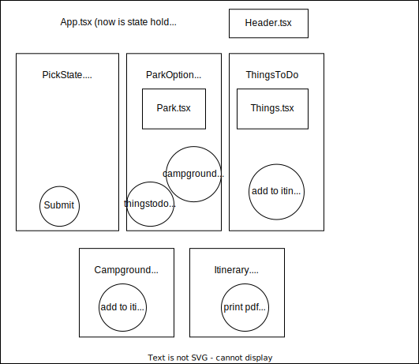

## National Park Party

### by Henry Oberholtzer & Kim Robinson

_A pair project for Epicodus using React, Vite, Typescript, API calls_



Goals for development:
* link to book campground (automate?)
* if user chooses activity/park/camp, saved to local storage (eventually database?) - Itinerary component
* add webcam call?
* change Sorry msg if no campground or things to do to stay on ParkOptions page and display msg instead of routing to things or campground component with msg there. (button lives in Park.tsx)
* low priority, remove campground button from sites without campgrounds.

Components:
```
App
├── Header
│ - Displays choices made by user?
├── FindPark (Control)
│ ├── ZipForm 
│ │ - User enters zipcode, API call is made to NatParks
│ ├── ParkOptions [iterated, possibly all Options are re-usable]
│ │ - First three (nearest?) results are shown
│ │ - Possible button to reshuffle to different options
│ │ - When a user selects a park, takes user to things to do
│ │ - - Makes API call for activities and campground options
│ ├── ActivitiesOptions
│ │ - Possible way to select activities to do
│ │ - Once activities are selected, moves to the campground options
│ ├── CampgroundOptions
│ │ - Lists campground options available in the park selected
│ │ - Once a campground is selected, move to display all user choices
│ ├── Itenerary
│ │ - Renders all choices in a nice and neat list
│ │ - Gives user a link to book campground
│ │ - Maybe a way to print out the choices / save as a file??
```